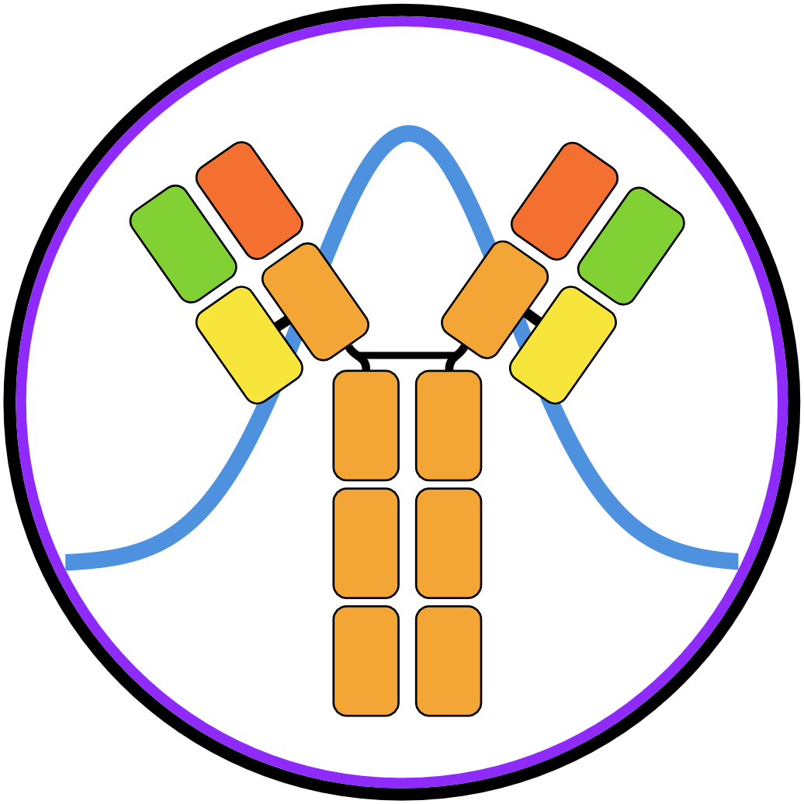

# sumrep 
 A *sum*mary statistic framework for BCR and TCR *rep*ertoires 

### Introduction
`sumrep` is a package for summarizing, visualizing, and comparing immune receptor repertoires.
It contains dozens of different summary statistics to be applied on various levels of assumptions, from raw query reads to  inferred phylogenies, as well as easy and principled ways to plot and compare repertoires.
It currently supports the IgH, IgL, IgK, TRA, and TRB loci.

Instructions for getting and using `sumrep` can be found via the following pages:

  * [Installation](docs/installation.md) - Steps for installing sumrep and optional annotation and simulation tools
  * [Docker image](docs/docker.md) - Instructions for using Docker to obtain a readily usable version of `sumrep` in a controlled environment
  * [Usage](docs/usage.md) - Quickstart on how to use `sumrep` to analyze and gain insights from your data, including examples
  * [Extended documentation](docs/extended_documentation.md) - In-depth breakdown of data specifications and functionality
  * [FAQ](docs/faq.md) - Frequently asked questions about `sumrep`

A paper describing `sumrep` can be found [here](https://www.frontiersin.org/articles/10.3389/fimmu.2019.02533/full).
Please cite this publication if you use `sumrep` for your analysis.

##
Please submit an issue if you encounter a problem not addressed above!
